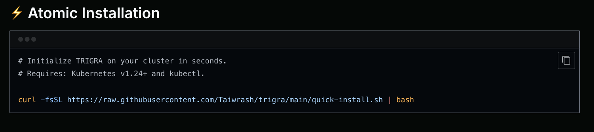
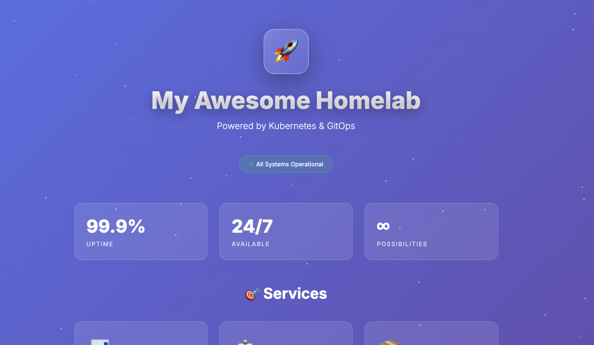

Hey folks! 👋 

[](https://www.youtube.com/watch?v=rX7gjp1WW4w)


*How Trigra works: Git push → Webhook → Kubernetes cluster updates*

## Why I Built This

Look, I love Kubernetes. I love GitOps. But here's the thing – tools like ArgoCD and FluxCD are amazing, but they can feel like overkill when you're just trying to manage your homelab or a small cluster. You shouldn't need to read a 50-page documentation just to get started with GitOps.

So I built Trigra. It's simple: you push YAML files to Git, and your cluster updates automatically. That's it. No complex configurations, no steep learning curve.

## What Makes Trigra Different?

**It's stupidly simple.** One install command and you're done:

```bash
curl -fsSL https://raw.githubusercontent.com/Taiwrash/trigra/main/install.sh | bash
```


*Literally takes less than 3 minutes from zero to GitOps*

**It supports everything.** Deployments, Services, ConfigMaps, Secrets, StatefulSets, DaemonSets, Jobs, CronJobs, Ingress, PVCs – if Kubernetes can run it, Trigra can deploy it.

**It's webhook-driven.** Push to GitHub, and boom – your cluster updates. No polling, no waiting around.

**It works everywhere.** Homelab? Check. Edge clusters? Check. Enterprise? Absolutely. I've even tested it on my local Minikube setup.

## The Journey

This started as a weekend project to scratch my own itch. I wanted GitOps for my homelab without the complexity. Then I realized – if I need this, others probably do too.

I've been dogfooding it for weeks now, deploying everything from simple Nginx servers to full-blown AI models with Ollama. It just works.


*Running a full homelab dashboard with Trigra – deployed straight from Git*

## What's Next?

Trigra is open source (MIT licensed) and ready for you to try. I'm planning to submit a talk proposal for various conferences in this 2026 about it, and honestly, I'm just excited to see what the community builds with it.

The repo has everything you need:
- Quick install scripts
- Example deployments (including a Homepage dashboard and Ollama AI setup)
- Full documentation
- Helm charts (coming soon!)

## Try It Out

If you're running Kubernetes anywhere – homelab, cloud, edge – give Trigra a shot. It takes literally 3 minutes to get started.

Check it out: [github.com/Taiwrash/trigra](https://github.com/Taiwrash/trigra)

And hey, if you run into issues or have ideas, open an issue or PR. This is for the community, built by someone who just wanted Kubernetes to be a bit less complicated.

[Check and upvote us on Product Hunt!](https://www.producthunt.com/products/trigra?launch=trigra)

Happy GitOps-ing! 🚀

---

*Taiwrash cares...*
