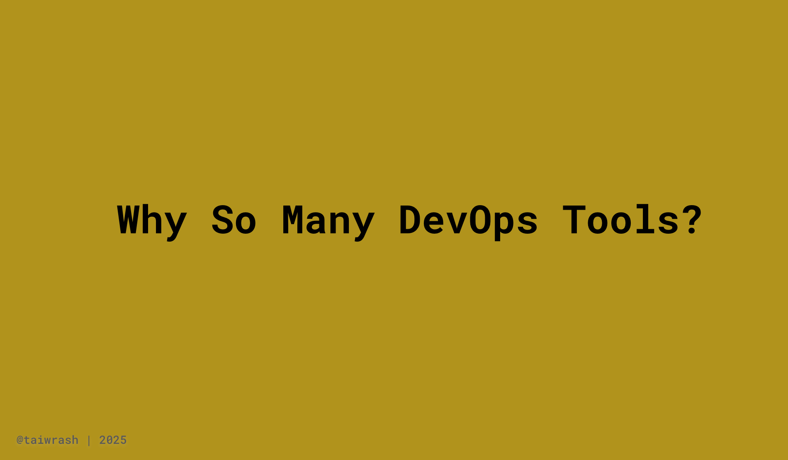

# Why So Many DevOps Tools?

The move away from vendor lock-in has been on the rise since the mid-2000s. Back in 2007, a company called **Fotango**, owned by Canon, launched [**Zimki**](https://www.zimki.com/info/whyzimki.html), one of the first examples of a modern **Platform-as-a-Service (PaaS)**. Zimki lets developers write applications in JavaScript and run them on the platform without worrying about servers. It introduced the idea of scaling by making applications self-contained. But the model struggled, mainly because of **complete vendor lock-in**, limited language support (JavaScript only), and lack of portability. The fact that Canon didn’t include cloud in their 2008 plan was part of the reasons why Zimki shut down.

Despite Zimki’s early exit, it proved one thing: developers wanted to focus on writing code, not managing servers. But to make that work, platforms had to offer **more flexibility**, **language support**, and **portability**.

Then came [**Heroku**](https://web.archive.org/web/20081202031219/http://heroku.com/), also in 2007, which introduced a more developer-friendly PaaS experience. Heroku’s use of **buildpacks** allowed support for multiple languages, making it easier to run applications across different stacks without vendor lock-in at the same level as Zimki.

Not long after, **Google launched App Engine in 2008**. It offered something Heroku lacked at the time: **automatic horizontal scaling**. This was a big step forward. But the ecosystem still had challenges especially around **dependency management** and the ever-present _“it works on my machine”_ problem.

That’s where **Docker** came in. Introduced in **2013**, Docker built on **LXC**, which by then was a stable containerization technology in the Linux world. Docker simplified container usage and provided a clean developer interface, making it easier to package, distribute, and run applications consistently across environments.

---

### You can see the pattern:

- **Zimki** sparked the idea  
- **Heroku** added flexibility  
- **Google App Engine** brought autoscaling  
- **Docker** delivered portability and developer experience

As each tool fixed the pain points of the one before, we got a wave of new ideas and standards.

---

Then in **2015**, Google donated **Kubernetes**, originally inspired by their internal system **Borg**, to the open source community. That led to the founding of the **Cloud Native Computing Foundation (CNCF)**, which was created to **govern and grow the cloud-native ecosystem**. CNCF provides **vendor-neutral oversight**, **open governance**, and a **framework for projects** to mature through sandbox, incubation, and graduation phases.

With source code being open, developers can build on top of existing tools, fix problems they encounter, or fork and create entirely new solutions. That freedom brings innovation, but it also introduces complexity. More use cases means more edge cases, which leads to more tools to address them.

---

So when you ask, _“Why are there so many DevOps tools?”_, it’s not just hype. It’s because developers, teams, and companies keep running into new challenges and keep building better answers.

That’s the spirit of DevOps.  
And it’s the heart of the open-source community **CNCF** supports.

