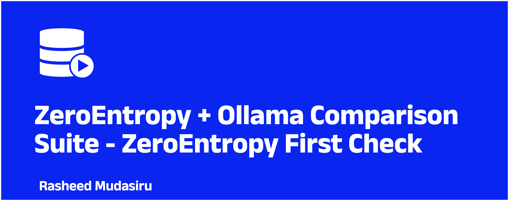
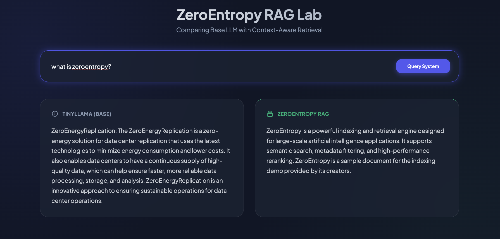

This guide explores building a high-performance, private RAG comparison lab using [**ZeroEntropy**](https://.zeroentropy.dev) for state-of-the-art semantic retrieval and **Ollama** for local inference.

---


## 🏗 The Architecture

To build a truly "premium" experience, we decoupled the stack into three distinct layers:


1.  **The Index & Retrieval Engine (ZeroEntropy)**: Using `zerank-2` for neural reranking to ensure only the highest-quality context reaches the model.
2.  **The Local Generation Engine (Ollama)**: Running `TinyLlama` locally for privacy and speed.
3.  **The Comparison Lab (FastAPI + Glassmorphism UI)**: A UX-first interface to prove the efficacy of RAG side-by-side with base model responses.

---

## 📦 Step 1: Intelligent Indexing

A great AI experience starts with clean data. ZeroEntropy handles complex document types like PDFs via Base64, but the real power lies in **Metadata Filtering**.

```python
# 01_indexing.py snippet
def index_document(path, text, tags):
    zclient.documents.add(
        collection_name="knowledge_base",
        path=path,
        content={"type": "text", "text": text},
        metadata={
            "category": "technical",
            "list:tags": tags  # Mandatory 'list:' prefix for list-based search
        }
    )
```

---

## 🔍 Step 2: Precision Retrieval with Standalone Reranking

Standard vector search often misses the mark. We integrated ZeroEntropy's standalone reranker to refine results from potential candidates. This ensures the prompt context is dense with actual relevance.

```python
# Standalone Reranking logic
reranked = zclient.models.rerank(
    query="How does the indexing work?",
    documents=results_from_base_search,
    k=3
)
# result.relevance_score gives us a precision metric we can surface in the UI
```

---

## 🧠 Step 3: The RAG Integration Loop

Bridging local LLMs with cloud-native retrieval requires a robust networking setup. The logic is simple but powerful `(check the demo repo for full details on how to set up FastAPI and Ollama locally using cloud-native approach with Docker)`:

1.  **Retrieve** relevant snippets from ZeroEntropy.
2.  **Augment** the system prompt with that specific context.
3.  **Generate** a grounded answer using Ollama.

```python
def generate_rag_response(user_query):
    # 1. ZeroEntropy Retrieval
    snippets = zclient.queries.top_snippets(query=user_query, reranker="zerank-2")
    context = "\n".join([s.content for s in snippets.results])

    # 2. Ollama Local Generation
    response = ollama_client.chat(
        model='tinyllama',
        messages=[
            {'role': 'system', 'content': f"Context: {context}"},
            {'role': 'user', 'content': user_query}
        ]
    )
    return response.message.content
```

---

## 🎨 Step 4: Crafting the Comparison UX

The implementation isn't finished until the user can **see** why it’s better. We built a side-by-side comparison tool with a focus on modern aesthetics:

-   **Glassmorphism**: Using `backdrop-filter` for a premium feel.
-   **Micro-animations**: A custom CSS loader to keep users engaged during "Thinking" time.
-   **Direct Evidence**: Showing the base model failing vs the RAG model succeeding.

> 

---

## 🛠 Lessons in Developer Experience (DX)

Building this demo highlighted several key SDK ergonomics:
- **Pydantic First**: The ZeroEntropy SDK returns typed objects, requiring dot-notation access (`result.content`) rather than dictionaries.
- **Prefixing**: Metadata lists require the `list:` prefix, a crucial detail for scalable filtering.
---

## Demo It Yourself Using this Repo
Check out the full codebase here: [github.com/Taiwrash/zey-ollama-rag-lab](https://github.com/Taiwrash/zey-ollama-rag-lab)

> Find the complete implementation, including Docker setup to run on isolation as a container other than running everything directly on your personal device, FastAPI backend, and the Glassmorphism UI.

## 🚀 Conclusion

By combining ZeroEntropy's precision with Ollama's local privacy, we've created a dev-first RAG environment that isn't just a script, but an **Experience**.
